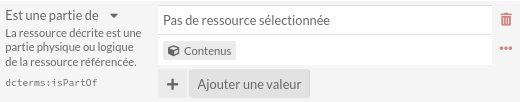
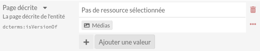

Alimentation 
============

Le site enob contient trois niveaux de contenus.

#. La description des "entités intellectuelles" (item) auxquelles sont rattachées les numérisations du fonds de l'INHA (media) 
#. La description pages des entités intellectuelles
#. Les références bibliographiques mobilisées par JB   

.. _num:

Ajout de nouvelles numérisations
--------------------------------

Description des pages
---------------------

#. Se rendre dans "Ressources">contenus
#. "Ajouter un nouveau" contenu en haut à droite
#. Choisir le modèle de ressources "Pages des carnets ou des feuillets"
#. Compléter les informations.

.. note::
   
   Il faut absolument renseigner les champs "Est une partie de" et "Page décrite" pour faire le lien entre, respectivement, la description de l'entité globale (carnet ou feuillet) et la numérisation de la page (=media)

.. attention::

   En ce moment, il y a un bug qui touche le champ "Page décrite". À la création d'un nouveau contenu, on ne peut pas sélectionner de page (media) comme montré ci-dessous.
   
   .. image:: img/enob_isversionof.png
   
   Il faut alors enregistrer le contenu, puis le modifier et la sélection de media pour aller chercher la page numérisée est alors possible.

Ajout des références bibliographiques
-------------------------------------

#. Choisir le modèle de ressources "Source scientifiques - Livre" ou "Source scientifiques - Article"
#. Compléter les informations.
#. Choisir le modèle de ressources "Source scientifiques - Livre" ou "Source scientifiques - Article"
#. Compléter les informations.

